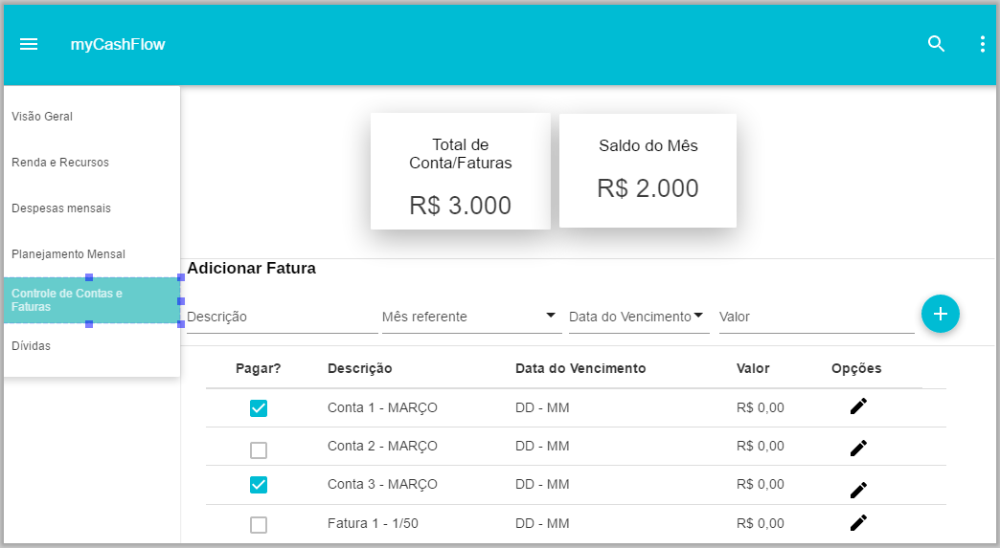
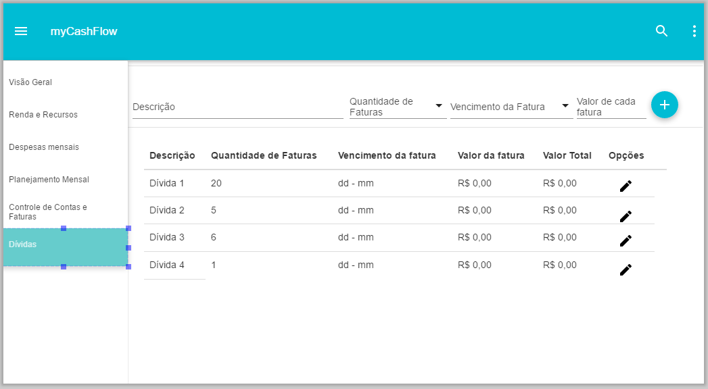

|                     | **CENTRO UNIVERSITÁRIO 7 DE SETEMBRO** |                                        |
| ------------------------------------------------------------ | :------------------------------------- | :------------------- |
| **Curso:**                                                   | Sistema de Informação                  |                      |
| **Disciplina:** Estágio II                                   | **Professor (a):**Marcelo Bezerra      | **Data:** 22/03/2019 |
| **Aluno:** Hugo Torres                                       |                                        | **Avaliação:** **10** |
|                                                              | **V1 – Primeira Chamada**              |                      |

### **Questão 1.** Controle de versão - GIT

   - Crie nesta mesma pasta um documento com o mesmo formato mudando para o seu nome completo e responda a prova. **- OK**

   - Acesse o arquivo README.md da pasta equipe e adicione o seu nome e crie uma nova versão colocando como comentário: "Meu nome é:"+<seu nome completo>
      * [9c66dffbe1277d1908377ef6c6ecfcc65d8ca1e4(https://github.com/mbacefor/estagio2Uni7/blob/9c66dffbe1277d1908377ef6c6ecfcc65d8ca1e4/2019/01/equipe/README.md) **- Ok**

   - Veja qual é o terceiro comentário (histórico) que existe no arquivo README.md da pasta inicial do repositório. **- OK**
      * [191e323da69878ca5d59268bf63e5023cd44e64e](https://github.com/mbacefor/estagio2Uni7/commit/191e323da69878ca5d59268bf63e5023cd44e64e#diff-04c6e90faac2675aa89e2176d2eec7d8)

   - Adicione o seu nome no arquivo README.md na pasta projetos. Seu nome deve ser colocado no projeto que você vai participar. Se não tiver o projeto crie.-**OK**
      * [4fe98b31b4fd677b50c18e325214c18fb021d4ea](https://github.com/mbacefor/estagio2Uni7/commit/4fe98b31b4fd677b50c18e325214c18fb021d4ea)

​     

### **Questão 2.** xMind

- Adicione o seu nome como membro da equipe no mapa mental se seu projeto. Qual o seu projeto?

   - Identifique no mapa mental, quais funcionalidades você vai implementar. **-OK**
      * [Mapa Mental myCashFlow](https://github.com/mbacefor/estagio2Uni7/blob/master/2019/01/projetos/myCashFlow/myCashFlow-Plano%20de%20Projeto.xmap)

### **Questão 3.** Pencil

- Escolha uma das funcionalidades que você vai implementar e elabore o protótipo de tela.**-OK**
   * Controle de Contas e Faturas;
      * 
   * Controle de Dívidas;
      * 

### **Questão 4.** Planejamento

- Escolha uma das funcionalidades que você vai implementar e faça um descrição do que vai ser essa funcionalidades, com seu cenários de uso e regras de negócio. - **OK**

   * Controles de contas e faturas: Essa tela permite ao usuário gerenciar as contas mensais e faturas de cobranças ou serviços(cartão de crédito, TV por assinatura,...).

      * Listar Contas e Faturas: Permite ao usuário visualizar todas as suas contas e faturas.

      * Adicionar Conta/Fatura: Permite ao usuário cadastrar suas contas ou faturas.

   * Controle de Dívidas: Essa tela permite ao usuário o gerenciamento de dívidas e pendências.
      * Listar Dívidas: Essa funcionalidade permite ao usuário visualizar todas as dívidas com seus valores totais juntamente com os valores de suas faturas mensais e das pendências a serem pagas.
      * Adicionar Dívida: Essa funcionalidade permite que o usuário adicione uma dívidas e as suas respectivas faturas que estarão nas lista de `Contas e Faturas`
      * Adicionar pendência: Essa funcionalidade permite marcar uma conta/fatura como pendência no caso ela esteja em atraso.
### **Questão 5.** Arquitetura

- Descreva como será a arquitetura do seu sistema. **- OK**
   * MERN:
      * Back-end:
         * **M**ongo(Banco de Dados)
         * **E**xpress
         * **N**odeJS
      * Front-end:
         * **R**eact
   * Microservices

**MISSÃO INSTITUCIONAL**

“Contribuir para o desenvolvimento da sociedade, educando para a cidadania, propiciando a formação de profissionais competentes, felizes e éticos. “

