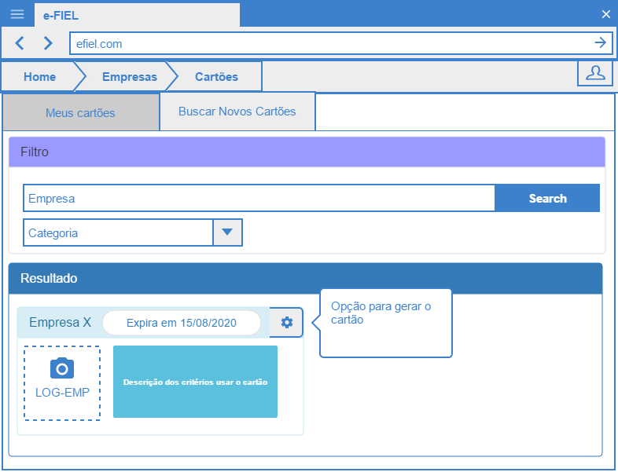

# Gerar Cartão Fidelidade

## Descrição

Esta funcionalidade permite o cliente consultar cartões disponíveis e gerar um cartão para aquela empresa.

## Telas

- **Tela de busca e geração do Cartão**

## Cenários de uso

- Buscar Cartões

  Este cenário permite o cliente digitar um texto para filtrar ou escolher categorias e solicitar que a aplicação busque cartões disponíveis que ainda não foram criados pelo cliente.
  
- Gerar Cartão

  Esse cenário irá permitir o cliente gerar um cartão de uma empresa previamente cadastrada.

## Regras de Negócio

- 