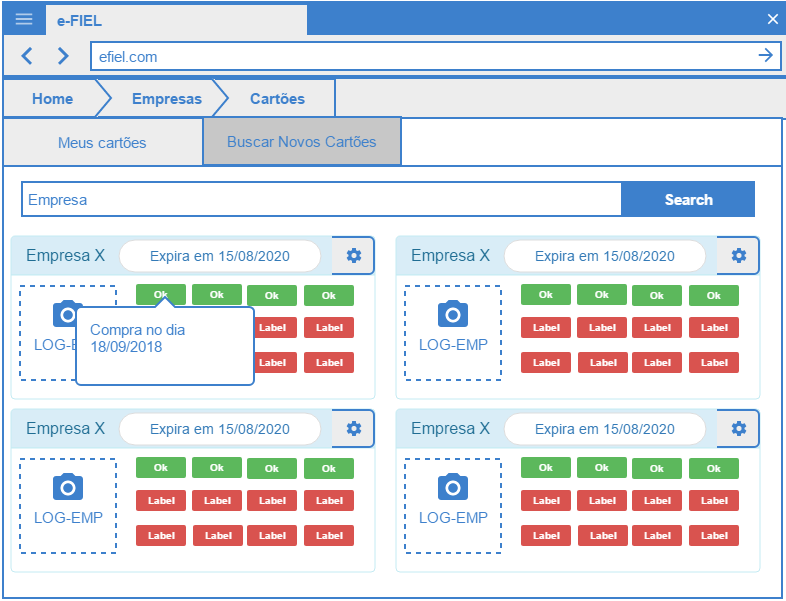

# Manter Meus Cartões

## Descrição

Esta funcionalidade permite o cliente fazer a manutenção (Listar, Excluir, Detalhar Cartão e Detalhar Selo) dos seus cartões.

## Telas

- Tela Listagem Cartão

  

  

## Cenários de uso

- Listar Cartões

  Este cenário permite o cliente digitar um texto para filtrar a exibição dos seus cartões cadastrados. 
  
  A aplicação exibirá os seus cartões cadastrados. 

- Excluir Cartão

  Esse cenário permite que o usuário exclua um cartão previamente selecionado.

- Detalhar Informações do Cartão

  Esse cenário permite o usuário detalhar os dados de um cartão por ele escolhido.

- Detalhar informação do Selo 

  Esse cenário permite o cliente ter informação sobre um selo ganho de um cartão selecionado.

## Regras de Negócio

- 