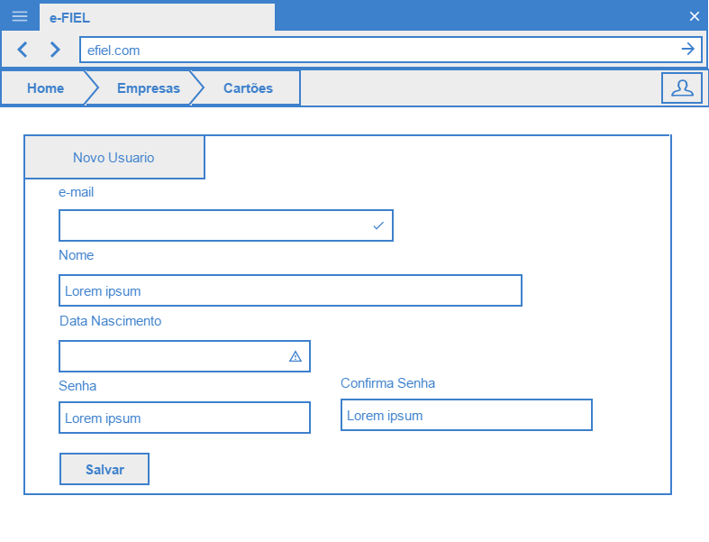
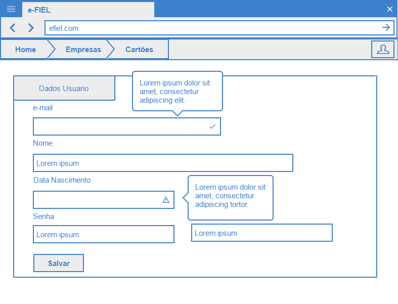

# Realizar Cadastro de Usuário:

Essa funcionalidade pelo cadastro de usuário (Edição e Criação).

## Telas

- Tela Cadastro Novo Usuário

  

  Tela edição do usuário

  

### Cenários dessa funcionalidade:

+ Cadastrar Novo Usuário
    - Nesse cenário o usuário ainda não esta cadastrado na aplicação e quer se cadastrar.
+ Editar Usuário
    - Esse cenário permite o usuário alterar os seus dados cadastrais e sua senha.

### Regras dessa funcionalidade:
+ Unicidade de e-mail
    - Não pode ter o mesmo email cadastrado para outro usuário.
+ Senha criptograda
    - A senha do usuário deve ser criptografada.
+ Tamanho da senha
    - O tamanho mínimo da senha deve ser 6 caracteres alfanuméricos
