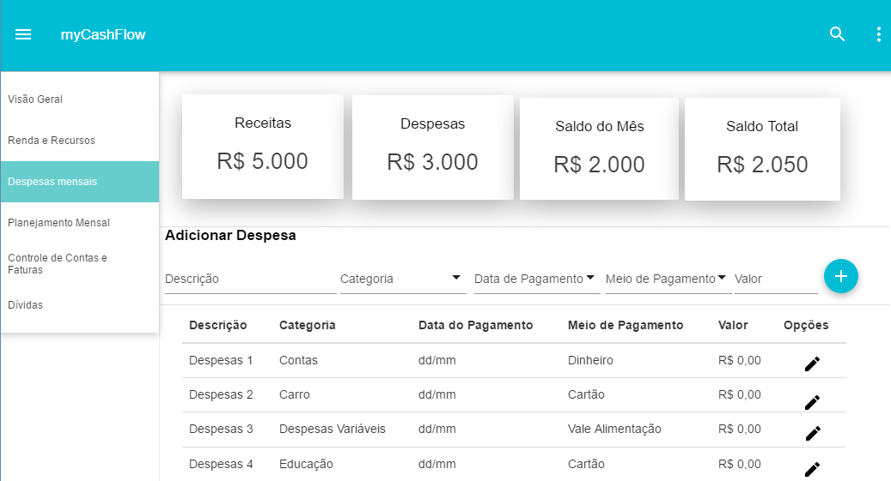

# Despesas Mensais

## Descrição

Essa funcionalidade é responsável pelo cadastro de novas despesas.

## Telas

- Tela de Despesas Mensais.

## Cenários dessa funcionalidade:

Cadastro Despesa:

- Nesse cenário o usuário previamente cadastrada as informações da despesa, como nome da despesa, categoria, data de pagamento, meio de pagamento e valor

Listar Despesa

- Este cenário permite o usuário listar as despesas anteriormente cadastradas e os novos.

Excluir Despesa

- > Esse cenário permite que o usuário exclua um despesa previamente selecionado.

## Regras dessa funcionalidade:

Cadastro despesas

- Ao cadastrar uma nova despesa o valor do saldo deve ser atualizado para refletir a mudança.

Tamanho da descrição da despesa

- O tamanho máxima é de 30 caracteres
