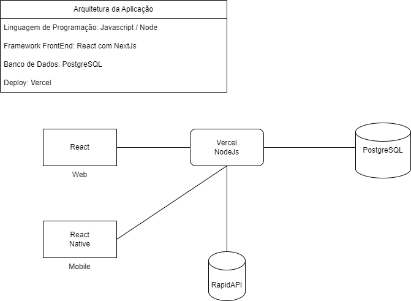

| `` | **CENTRO UNIVERSITÁRIO SETE DE SETEMBRO**   CURSO DE GRADUAÇÃO EM SISTEMAS DE INFORMAÇÃO    1ª AVALIAÇÃO  |  |
| --------------------------------------------------------------- | ------------------------------------------------------------------------------------------------------------------------------------- | --------------------------------------- |

| **ALUNO:**      | Marcéu Almeida Rodrigues     | **MATRÍCULA:**       | 56042329   |
| :-------------------- | ----------------------------- | :-------------------------- | ---------- |
| **DISCIPLINA:** | Estágio 2                    | **DATA DA PROVA:**    | 09/10/2023 |
| **PROFESSOR:**  | Marcelo Bezerra de Alcântara | **TIPO DE PROVA:**    | Online     |
| **TURMA:**      | SI05N01                       | **CÓDIGO DA TURMA:** | UNI7T015   |
|                       |                               | **NOTA:**             |            |

### **Questão 1.** Controle de versão - GIT

- Crie nesta mesma pasta um documento com o mesmo formato mudando para o seu nome completo e responda a prova. OK
- Acesse o arquivo **EstagiosUni7\Estagio1\2023\02\Alunos\README.md** e adicione o seu nome com o nome do projeto: "Meu nome é:"+`<seu nome completo>`-` Link do projeto:<link do projeto no github> OK`
- Veja qual é o terceiro comentário (histórico) que existe no arquivo README.md do repositório.
  R: [adicionando link github](https://github.com/mbacefor/estagiosUNI7/commit/4f8e9707aee755f9e2bd13316dca05db69e42fb7)

### **Questão 2.** Github

- Crie um repositório no github com nome do seu projeto; OK
- Crie um arquivo README.md com os seguintes tópicos:

  1. #### Objetivo

     A aplicação procura facilitar e otimizar o processo de treinamento em academias de musculação. O objetivo central é dar uma autonomia ou independência ao aluno matriculado e não sobrecarregar o instrutor ou professor com perguntas básicas relacionadas a execução do exercício proposto em suas fichas de treino.
  2. #### Descrição do Sistema

     A aplicação fará uma integração e consumirá dados da API RapidAPI. Onde será retornado ao sistema figuras GIF que exibirão a forma correta de execução do exercício.
  3. #### Partes Interessadas

     Usuários, Professores e donos de academias de musculação.
  4. #### PERSONAS

     Usuários:

     Professores

     Alunos

     API:
     *RapidAPI / ExerciseDB: Api utilizada como insumo para animações dos exercícios contidos na ficha de treino.
  5. #### Necessidades e Funcionalidades

     - CRUD(Aluno, Professor, Treino)
     - Integração com API

     1. #### Arquitetura

        Linguagem de Programação: Javascript

        Framework FrontEnd: React com NextJS

        Banco de Dados: Postgres

        Deploy: Vercel
  6. #### Configuração Ambiente

### **Questão 3.** Kanban

    [https://trello.com/invite/b/Rpw3vllP/ATTIbbf77d3efd8294c55600f784b10feaeb87FF0CFD/kanban-e-academia](https://trello.com/invite/b/Rpw3vllP/ATTIbbf77d3efd8294c55600f784b10feaeb87FF0CFD/kanban-e-academia)

### **Questão 4.** Arquitetura

* Crie o esqueleto do projeto;

**MISSÃO INSTITUCIONAL**

“Contribuir para o desenvolvimento da sociedade, educando para a cidadania, propiciando a formação de profissionais competentes, felizes e éticos. “
